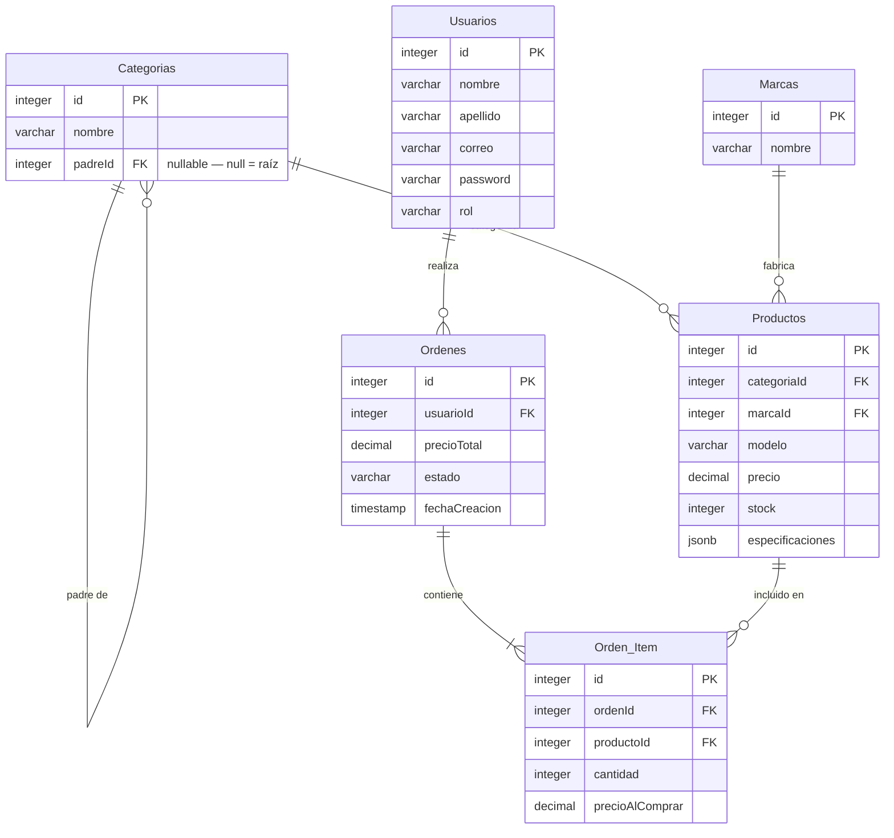

# PC Builder — Relational Schema

## ERD

## Design notes

- `Categorias.padreId` is self-referential and nullable. Root nodes (`Componentes`, `Periféricos`, etc.) have `padreId = NULL`. Enables arbitrary-depth trees for compatibility hierarchies (e.g. `Componentes > Procesadores > Procesadores Intel > Procesadores Intel LGA1151`).
- `Productos.especificaciones` is a `jsonb` column. It holds component-specific attributes (`socket`, `ram_type`, `tdp`, `capacidad_gb`, etc.). Compatibility logic at the builder level is resolved by comparing jsonb values across selected components — the motherboard acts as the compatibility hub.
- Cart state is intentionally **not persisted** in the DB. It lives in `localStorage` keyed by `userId`. On checkout, the cart is read, prices are fetched fresh from the DB, and an `Orden` + `Orden_Item` snapshot is written.
- `Orden_Item.precioAlComprar` captures the price at the moment of purchase. `Productos.precio` may change over time; order history must not be affected.
- `Ordenes.estado` should be constrained to an enum: `pendiente | pagado | enviado | cancelado`.
- `Usuarios.rol` should be constrained to an enum: `admin | cliente`.
