# PC Builder — Relational Schema

## ERD

```mermaid
erDiagram
  Categorias {
    integer id PK
    varchar nombre
    integer padreId FK "nullable — null = raíz"
  }

  Marcas {
    integer id PK
    varchar nombre
  }

  Productos {
    integer id PK
    integer categoriaId FK
    integer marcaId FK
    varchar modelo
    decimal precio
    integer stock
    jsonb especificaciones
  }

  Usuarios {
    integer id PK
    varchar nombre
    varchar apellido
    varchar correo
    varchar password
    varchar rol
  }

  Carritos {
    integer id PK
    integer usuarioId FK
    timestamp createdAt
    timestamp updatedAt
  }

  Carrito_Item {
    integer id PK
    integer carritoId FK
    integer productoId FK
    integer cantidad
  }

  Ordenes {
    integer id PK
    integer usuarioId FK
    decimal precioTotal
    varchar estado
    timestamp fechaCreacion
  }

  Orden_Item {
    integer id PK
    integer ordenId FK
    integer productoId FK
    integer cantidad
    decimal precioAlComprar
  }

  Categorias ||--o{ Categorias : "padre de"
  Categorias ||--o{ Productos : "categoriza"
  Marcas     ||--o{ Productos : "fabrica"
  Usuarios   ||--|| Carritos  : "tiene"
  Carritos   ||--o{ Carrito_Item : "contiene"
  Productos  ||--o{ Carrito_Item : "incluido en"
  Usuarios   ||--o{ Ordenes   : "realiza"
  Ordenes    ||--|{ Orden_Item : "contiene"
  Productos  ||--o{ Orden_Item : "incluido en"
```

## Design notes

- `Categorias.padreId` is self-referential and nullable. Root nodes (`Componentes`, `Periféricos`, etc.) have `padreId = NULL`. Enables arbitrary-depth trees for compatibility hierarchies (e.g. `Componentes > Procesadores > Procesadores Intel > Procesadores Intel LGA1151`).
- `Productos.especificaciones` is a `jsonb` column. It holds component-specific attributes (`socket`, `ram_type`, `tdp`, `capacidad_gb`, etc.). Compatibility logic at the builder level is resolved by comparing jsonb values across selected components — the motherboard acts as the compatibility hub.
- `Carritos` is persisted in the DB keyed by `usuarioId` (1:1). This enables admin visibility into user carts and cart persistence across devices and sessions — both relevant for the role-based user-oriented requirements of the project. `createdAt`/`updatedAt` are managed automatically by Sequelize.
- `Carrito_Item` has a composite unique index on `(carritoId, productoId)` — the same product cannot appear twice in the same cart. Adding an existing product increments `cantidad` instead of creating a new row.
- `Orden_Item.precioAlComprar` captures the price at the moment of purchase. `Productos.precio` may change over time; order history must not be affected.
- `Ordenes.estado` is constrained to an enum: `pendiente | pagado | preparando | enviado | entregado | cancelado`.
- `Usuarios.rol` is constrained to an enum: `admin | cliente`.
